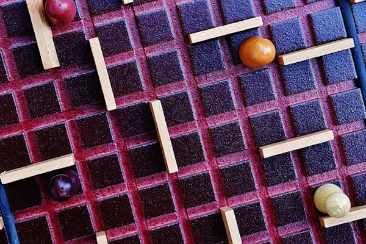
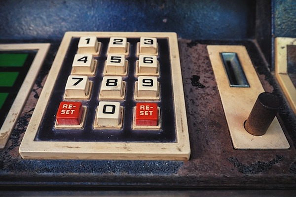

<!doctype html>
<html lang="en">
    <head>
        <meta charset="utf-8">
        <meta name="viewport" content="width=device-width,initial-scale=1">
        <meta http-equiv="X-UA-Compatible" content="IE=edge">
        <title>Emma's Portfolio</title>
        <link href="https://fonts.googleapis.com/css?family=Roboto:300,400,500" rel="stylesheet" type="text/css">
        <link rel="stylesheet" href="css/main.css">

    </head>
    <body>
        <header class="header">
            

                <a id="menu" class="menu_img">
<!--                      -->
                    <svg xmlns="http://www.w3.org/2000/svg" viewBox="0 0 24 24">
                        <path d="M2 6h20v3H2zm0 5h20v3H2zm0 5h20v3H2z"/>
                    </svg>
                </a>
                <svg id="logo" class="logo_img" xmlns="http://www.w3.org/2000/svg" viewBox="0 0 40 40" width="64" height="64">
                </svg>
            

            

                <h1 class="header_name">Emma Weng</h1>
                
Developer/Engineer

            

        </header>
        

        <nav id="drawer" class="nav">
            <ul class="nav_list">
                <li class="nav_item text-hdr"><a href="#">Home</a></li>
                <li class="nav_item text-hdr"><a href="#about">About</a></li>
                <li class="nav_item text-hdr"><a href="#project">Project</a></li>
                <li class="nav_item text-hdr"><a href="#contact">Contact</a></li>
            </ul>
        </nav>

        <main>
            <section class="content">
                <section class="hero">
                    
                </section>
                <section id="about" class="sec">
                    <h2 class="sec_title">About</h2> 
                    
I'm an application developer and problem solver who loves adventure and challenges. I strive to create elegant solutions to help companies streamline operational workflows. I have been worn many hats over the years - holding titles like product designer, front-end developer, product manager.

                </section>
                <section id="project" class="sec">
                    <h2 class="sec_title">Projects</h2> 
                    <ul class="project">
                        <li class="project_item">
                            <a href="https://emma319.github.io/RestaurantReviewAPP/" class="project_link" target="_blank" rel="noopener noreferrer">
                                
                                <h3 class="project_title">REVIEW APP</h3>
                            </a>
                            
<a href="https://github.com/Emma319/RestaurantReviewAPP" class="github_link" target="_blank" rel="noopener noreferrer">detail...</a>

                        </li>
                        <li class="project_item">
                            <a href="https://emma319.github.io/MemoryGame/" class="project_link" target="_blank" rel="noopener noreferrer">
                                
                                <h3 class="project_title">MEMORY GAME</h3>
                            </a>
                            
<a href="https://github.com/Emma319/MemoryGame" class="github_link" target="_blank" rel="noopener noreferrer">detail...</a>

                        </li>
                        <li class="project_item">
                            <a href="https://emma319.github.io/ArcadeGame/" class="project_link" target="_blank" rel="noopener noreferrer">
                                
                                <h3 class="project_title"> ARCADE GAME</h3>
                            </a>
                            
<a href="https://github.com/Emma319/ArcadeGame" class="github_link" target="_blank" rel="noopener noreferrer">detail...</a>

                        </li>
                        <li class="project_item">
                            <a href="https://emma319.github.io/MyBookshelf/" class="project_link" target="_blank" rel="noopener noreferrer">
                                
                                <h3 class="project_title">BOOK SHELF</h3>
                            </a>
                            
<a href="https://github.com/Emma319/MyBookshelf" class="github_link" target="_blank" rel="noopener noreferrer">detail...</a>

                        </li>
                    </ul>
                </section>
                <section id="contact" class="sec">
                    <h2 class="sec_title">Get in Touch</h2> 
                    <ul>
                        <li class="text">Email me at <a href="mailto:">ytweng7 @ gmail.com</a></li>
                        <li class="text">Follow me on <a href="https://www.linkedin.com/in/ytweng" target="_blank" rel="noopener noreferrer">LinkedIn</a></li>
                    </ul>
                </section>
            </section>

            <footer>
            </footer>
        </main>
        
    </body>
</html>
